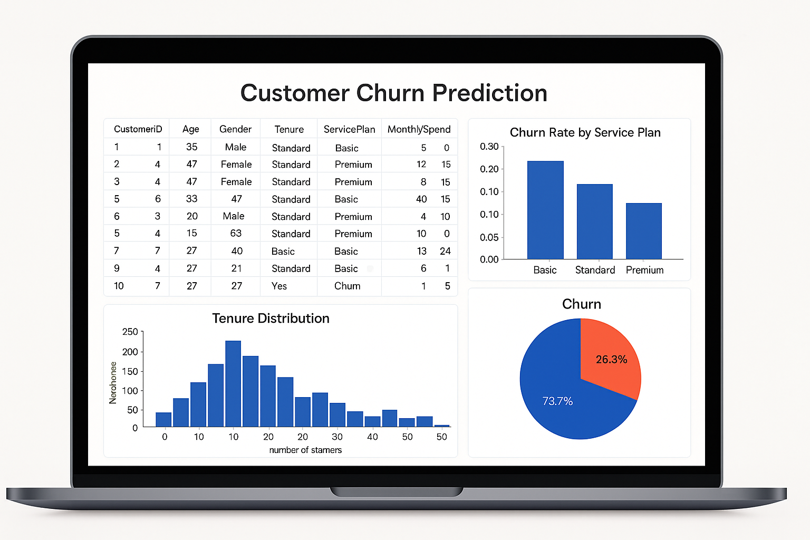
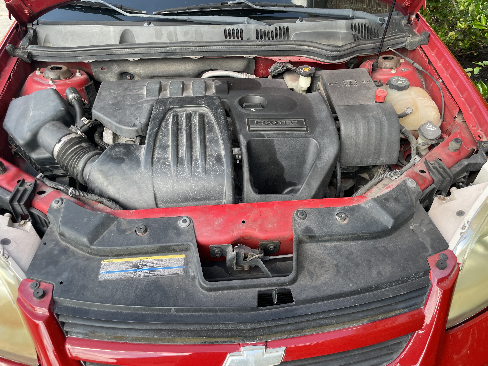

# Data Science Portfolio - Shaf Malik

This portfolio is a compilation of all the Data Science and Data Analysis projects I have done for academic, self-learning, and hobby purposes. It also contains my achievements, skills, and certificates. It is updated on a regular basis.

**Email**: [shafmalik05@gmail.com](mailto:shafmalik05@gmail.com)  
**LinkedIn**: [linkedin.com/shaf-malik-8a551329b](https://www.linkedin.com/in/shaf-malik-8a551329b/)

---

## Projects

### [Customer Survival Analysis and Churn Prediction](https://github.com/archd3sai/Customer-Survival-Analysis-and-Churn-Prediction)

In this project, I used survival analysis to study how the likelihood of customer churn changes over time. I also implemented a Random Forest model to predict customer churn and deployed the model using a Flask web app on Heroku.  
__TOPICS__

 

### [Instacart Market Basket Analysis](https://github.com/archd3sai/Instacart-Market-Basket-Analysis)

Analyzed 3 million grocery orders from over 200,000 Instacart users to predict which previously purchased items will be in the user's next order. Customer segmentation and affinity analysis were performed to study user purchase patterns.
__TOPICS__

 

### [Hybrid-filtering News Articles Recommendation Engine](https://github.com/archd3sai/News-Articles-Recommendation)

A hybrid-filtering personalized news recommendation system that suggests articles from popular news providers based on the reading history of similar Twitter users (collaborative filtering) and content similarity between articles and users’ tweets (content-based filtering).
__TOPICS__

 

