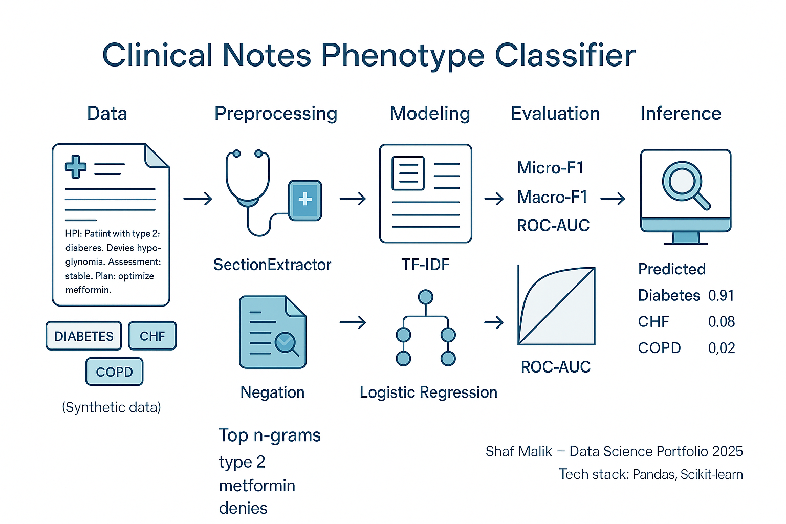

# Portfolio - Shaf Malik

This portfolio showcases my AI and data centric projects, spanning academic, self-learning, and hobbyist work. It highlights my skills, achievements, and certifications, with regular updates.

**Email**: [shafmalik05@gmail.com](mailto:shafmalik05@gmail.com)  
**LinkedIn**: [linkedin.com/shaf-malik-8a551329b](https://www.linkedin.com/in/shaf-malik-8a551329b/)

---

## Projects

### [Customer Survival Analysis and Churn Prediction](https://github.com/shafmalik/shaf.malik05/blob/main/Files/churn_data.ipynb)

This project focuses on predicting customer churn using machine learning models, leveraging historical customer data. By analyzing customer behavior, we can predict the likelihood of churn and take proactive measures to retain customers. It demonstrates the importance of data-driven decision-making in customer relationship management. 

 <!-- Clear the float -->

<strong>SKILLS: Pandas,Numpy,EDA,Scikit-learn,PowerBi/Tableau,Feature engineering </strong>

 

### [Real time stock prediciton with MLOPs deployment](https://github.com/shafmalik/shaf.malik05/blob/main/Files/Tensor.ipynb)

The real-time stock prediction project leverages machine learning to predict stock prices using historical data and deep learning models like LSTM. By implementing an MLOps pipeline, the model is continuously retrained with fresh data, ensuring accuracy and robustness in real-time predictions. The deployment, powered by FastAPI, enables seamless integration for live market predictions, allowing users to access up-to-date stock forecasts.

 <!-- Clear the float -->

<strong>SKILLS: MLOPs,Time Series, API, Docker/Dash</strong>

 

### [Phenotype](https://github.com/shafmalik/shaf.malik05/blob/052b446b25913deb35e561f584a7ff797a806714/Files/Asp.ipynb)

This project is alightweight, production-minded NLP pipeline that classifies clinical progress notes into multiple phenotypes (e.g., diabetes, CHF, COPD) using scikit-learn only—no tensors, no spaCy. It includes section-aware preprocessing, simple negation handling, interpretable features, and a CLI for training on your own notes.

 <!-- Clear the float -->

<strong>SKILLS: Deep Learning and NLP, scikit pipeline</strong>

 
