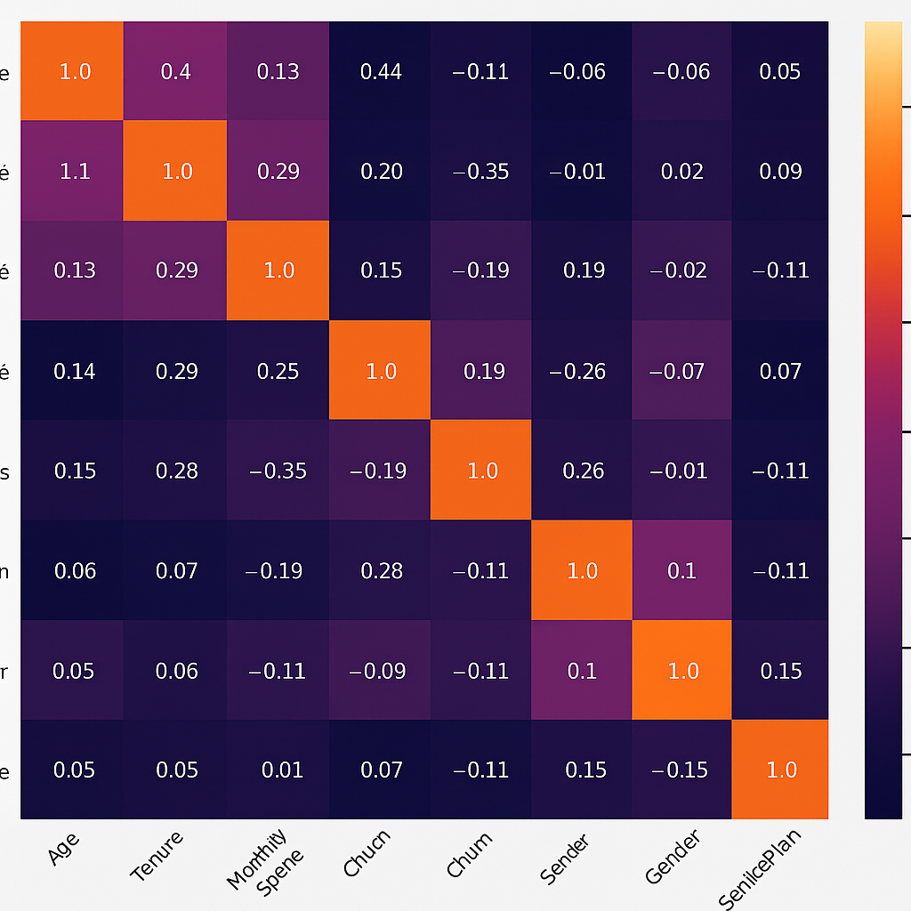

# Data Science Portfolio - Shaf Malik

This portfolio showcases my Data Science and Data Analysis projects, spanning academic, self-learning, and hobbyist work. It highlights my skills, achievements, and certifications, with regular updates.

**Email**: [shafmalik05@gmail.com](mailto:shafmalik05@gmail.com)  
**LinkedIn**: [linkedin.com/shaf-malik-8a551329b](https://www.linkedin.com/in/shaf-malik-8a551329b/)

---

## Projects

### [Customer Survival Analysis and Churn Prediction](https://github.com/archd3sai/Customer-Survival-Analysis-and-Churn-Prediction)

In this project, I used survival analysis to study how the likelihood of customer churn changes over time. I also implemented a Random Forest model to predict customer churn and deployed the model using a Flask web app on Heroku.  

 <!-- Clear the float -->

<strong>TOPICS</strong>

 

### [Instacart Market Basket Analysis](https://github.com/archd3sai/Instacart-Market-Basket-Analysis)

Analyzed 3 million grocery orders from over 200,000 Instacart users to predict which previously purchased items will be in the user's next order. Customer segmentation and affinity analysis were performed to study user purchase patterns.

 <!-- Clear the float -->

<strong>TOPICS</strong>

 

### [Hybrid-filtering News Articles Recommendation Engine](https://github.com/archd3sai/News-Articles-Recommendation)

A hybrid-filtering personalized news recommendation system that suggests articles from popular news providers based on the reading history of similar Twitter users (collaborative filtering) and content similarity between articles and users’ tweets (content-based filtering).

 <!-- Clear the float -->

<strong>TOPICS</strong>

 
