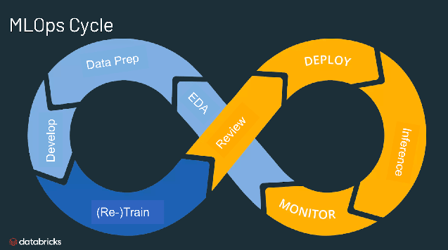

# Data Science Portfolio - Shaf Malik

This portfolio showcases my Data Science and Data Analysis projects, spanning academic, self-learning, and hobbyist work. It highlights my skills, achievements, and certifications, with regular updates.

**Email**: [shafmalik05@gmail.com](mailto:shafmalik05@gmail.com)  
**LinkedIn**: [linkedin.com/shaf-malik-8a551329b](https://www.linkedin.com/in/shaf-malik-8a551329b/)

---

## Projects

### [Customer Survival Analysis and Churn Prediction](https://github.com/archd3sai/Customer-Survival-Analysis-and-Churn-Prediction)

This project focuses on predicting customer churn using machine learning models, leveraging historical customer data. By analyzing customer behavior, we can predict the likelihood of churn and take proactive measures to retain customers. It demonstrates the importance of data-driven decision-making in customer relationship management. 

 <!-- Clear the float -->

<strong>SKILLS: Pandas,Numpy,EDA,Scikit-learn,PowerBi/Tableau,Feature engineering </strong>

 

### [Real time stock prediciton with MLOPs deployment](https://github.com/archd3sai/Instacart-Market-Basket-Analysis)

The real-time stock prediction project leverages machine learning to predict stock prices using historical data and deep learning models like LSTM. By implementing an MLOps pipeline, the model is continuously retrained with fresh data, ensuring accuracy and robustness in real-time predictions. The deployment, powered by FastAPI, enables seamless integration for live market predictions, allowing users to access up-to-date stock forecasts with minimal latency.

 <!-- Clear the float -->

<strong>SKILLS: MLOPs,Time Series, API, Docker/Dash</strong>

 

### [Pneumonia Detection](https://github.com/archd3sai/News-Articles-Recommendation)

This project uses deep learning techniques, particularly CNNs, to detect pneumonia from chest X-ray images. The model was trained on labeled datasets to classify images as either normal or pneumonia-infected. It showcases the application of AI in healthcare to assist in the early detection and diagnosis of life-threatening conditions.

 <!-- Clear the float -->

<strong>SKILLS: Deep Learning and OpenCV/Computer Vision</strong>

 
